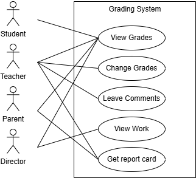

# Grading System

The Grading System is designed to make managing student performance in a school easier. It includes different user roles, such as teachers, directors, students, and parents each with specific tasks. This setup allows for efficient interaction and oversight, helping everyone keep track of grades and monitor progress effectively.

-   As the principal, I want to be able to oversee the work of the teachers.
-   As a teacher, I want to leave comments for students.
-   As a parent, I can only view my child's grades and receive their report card.
-   As a student, I want to be able to see my grades.
-   As a teacher I want to access and change the grades of students.

